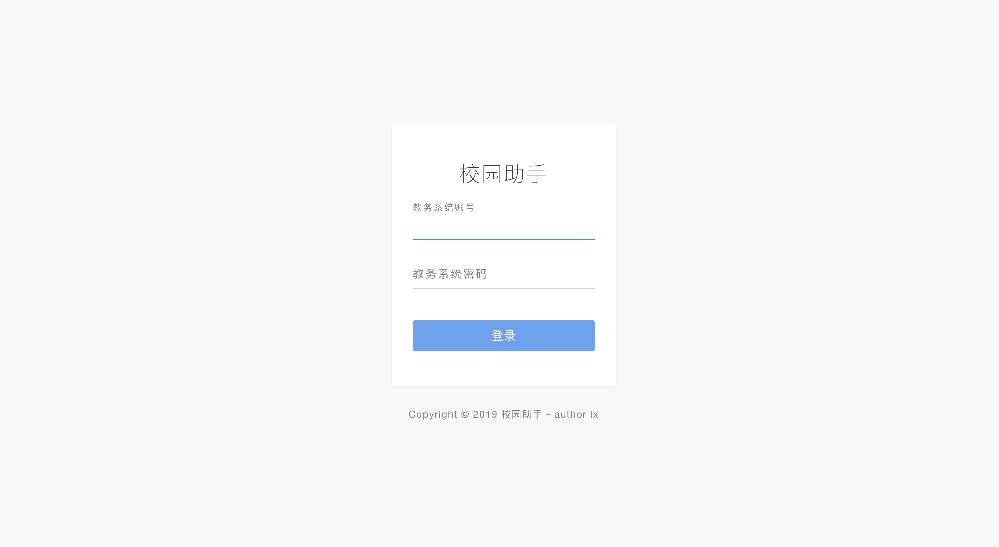
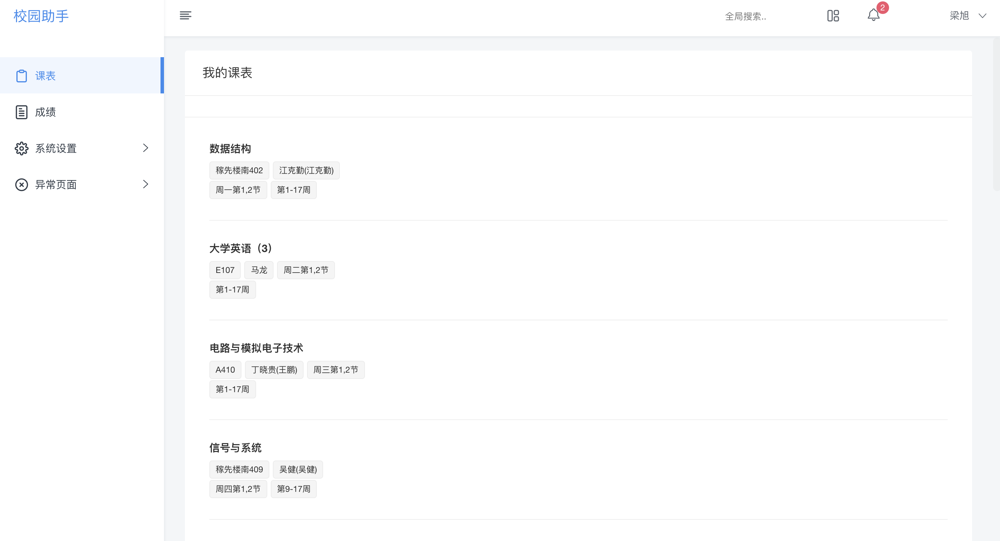

## 正方系统爬虫

(ps: 旧版正方系统)

#### 技术栈
1. springboot 2.x
2. jsoup 解析部分信息
3. libsvm 验证码识别
4. redis
5. 正则解析部分信息
6. vue 前端页面
7. Restful API

#### 项目运行
1. git 项目
2. 配置一个空数据库（以后存储用户数据，加快访问速度）
3. 配置redis（主要做session共享）

#### 图片
1 登录界面
   
2  主界面
 

 

